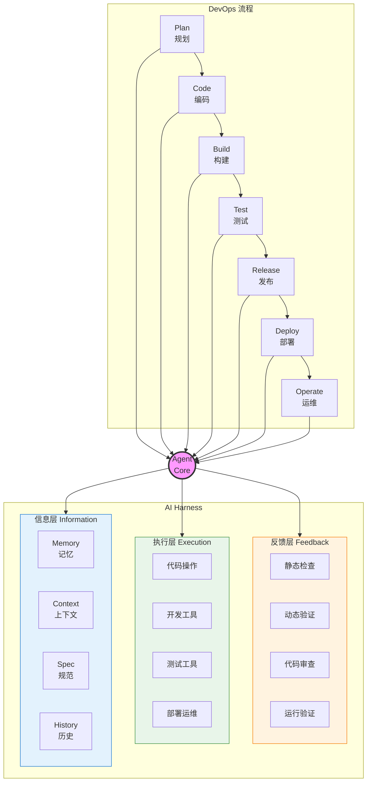
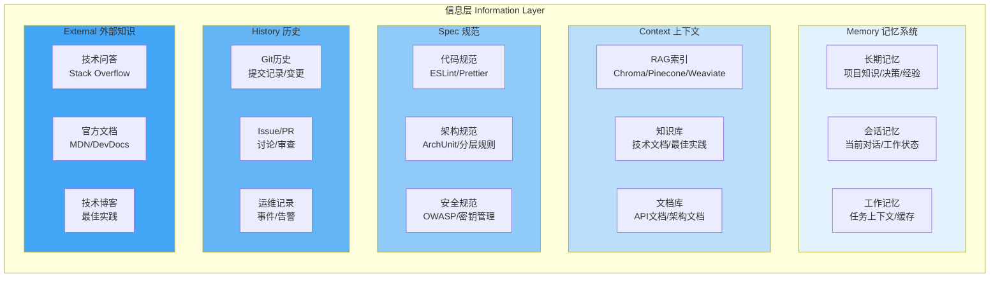
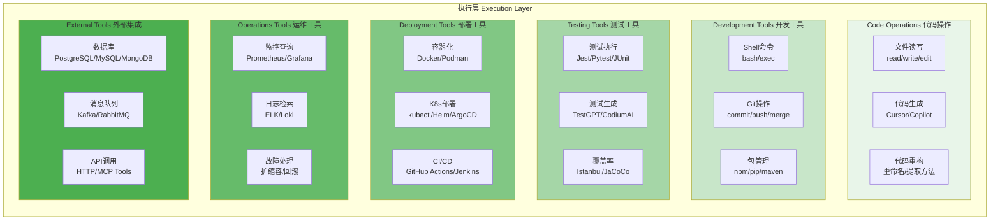
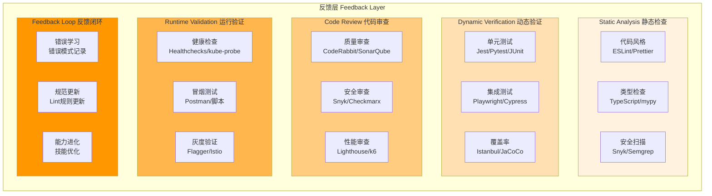
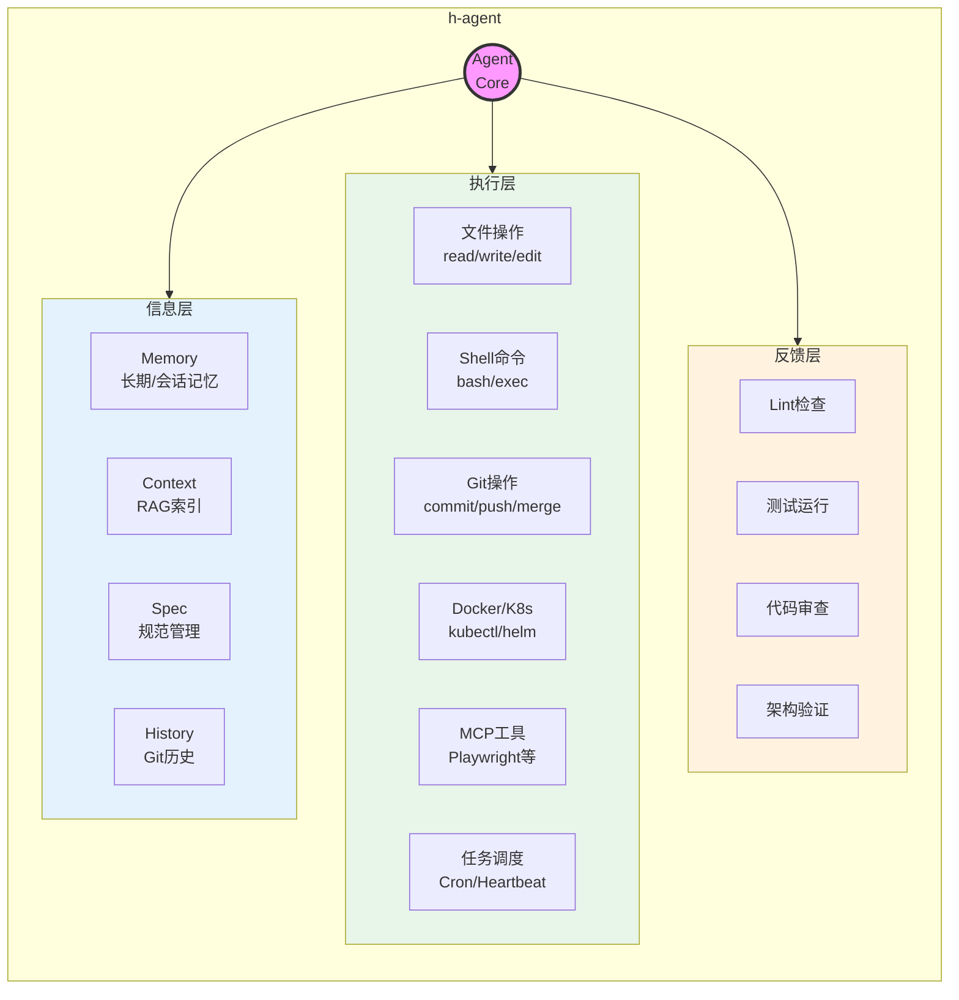

# AI辅助研发工具地图

> Harness三层架构 × DevOps流程矩阵，每层分类框内放置具体工具

---

## 核心架构



---

## 一、信息层 (Information Layer)



### 信息层工具表

#### Memory (记忆系统)

| 子类 | 工具 | 说明 | 链接 |
|------|------|------|------|
| 长期记忆 | **h-agent Memory** | 项目级持久记忆 | 内置 |
| | **LangChain Memory** | 对话记忆管理 | [python.langchain.com](https://python.langchain.com/) |
| | **Mem0** | AI记忆层 | [mem0.ai](https://mem0.ai/) |
| 会话记忆 | **h-agent Session** | 会话状态管理 | 内置 |
| | **Redis** | 会话缓存 | [redis.io](https://redis.io/) |

#### Context (上下文) - RAG工具

| 子类 | 工具 | 说明 | 链接 |
|------|------|------|------|
| 向量数据库 | **Chroma** | 开源向量数据库 | [trychroma.com](https://www.trychroma.com/) |
| | **Pinecone** | 托管向量数据库 | [pinecone.io](https://www.pinecone.io/) |
| | **Weaviate** | 开源向量搜索引擎 | [weaviate.io](https://weaviate.io/) |
| | **Milvus** | 云原生向量数据库 | [milvus.io](https://milvus.io/) |
| | **Qdrant** | 高性能向量数据库 | [qdrant.tech](https://qdrant.tech/) |
| RAG框架 | **LlamaIndex** | 数据框架 | [llamaindex.ai](https://www.llamaindex.ai/) |
| | **LangChain RAG** | RAG链 | [langchain.com](https://www.langchain.com/) |
| 代码索引 | **h-agent RAG** | 代码库索引 | 内置 |
| | **Sourcegraph** | 代码搜索 | [sourcegraph.com](https://sourcegraph.com/) |

#### Context (上下文) - 知识库

| 子类 | 工具 | 说明 | 链接 |
|------|------|------|------|
| 知识管理 | **Notion** | 知识库 | [notion.so](https://www.notion.so/) |
| | **Confluence** | 企业知识库 | [atlassian.com/confluence](https://www.atlassian.com/confluence) |
| | **Obsidian** | 本地知识库 | [obsidian.md](https://obsidian.md/) |
| 文档索引 | **Mintlify** | API文档 | [mintlify.com](https://mintlify.com/) |
| | **Swimm** | 代码文档 | [swimm.io](https://swimm.io/) |

#### Spec (规范)

| 子类 | 工具 | 说明 | 链接 |
|------|------|------|------|
| 代码规范 | **ESLint** | JS/TS Lint | [eslint.org](https://eslint.org/) |
| | **Prettier** | 代码格式化 | [prettier.io](https://prettier.io/) |
| | **Checkstyle** | Java Lint | [checkstyle.org](https://checkstyle.org/) |
| | **Ruff** | Python Lint | [docs.astral.sh/ruff](https://docs.astral.sh/ruff/) |
| 架构规范 | **ArchUnit** | Java架构测试 | [archunit.org](https://www.archunit.org/) |
| 安全规范 | **Snyk** | 漏洞扫描 | [snyk.io](https://snyk.io/) |

#### History (历史)

| 子类 | 工具 | 说明 | 链接 |
|------|------|------|------|
| Git历史 | **Git** | 版本控制 | [git-scm.com](https://git-scm.com/) |
| | **GitHub** | 代码托管 | [github.com](https://github.com/) |
| | **GitLab** | DevOps平台 | [gitlab.com](https://gitlab.com/) |
| Issue/PR | **GitHub Issues** | 问题追踪 | [github.com](https://github.com/) |
| | **Jira** | 项目管理 | [atlassian.com/jira](https://www.atlassian.com/jira) |
| | **Linear** | 现代项目管理 | [linear.app](https://linear.app/) |

#### External (外部知识)

| 子类 | 工具 | 说明 | 链接 |
|------|------|------|------|
| 技术问答 | **Stack Overflow** | 技术问答社区 | [stackoverflow.com](https://stackoverflow.com/) |
| 文档搜索 | **Perplexity** | AI搜索引擎 | [perplexity.ai](https://www.perplexity.ai/) |
| | **Phind** | 开发者搜索 | [phind.com](https://www.phind.com/) |

---

## 二、执行层 (Execution Layer)



### 执行层工具表

#### Code Operations (代码操作)

| 子类 | 工具 | 说明 | 链接 |
|------|------|------|------|
| 文件读写 | **read/write/edit** | 基础文件操作 | h-agent内置 |
| | **glob** | 文件搜索 | h-agent内置 |
| 代码生成 | **Cursor** | AI代码编辑器 | [cursor.sh](https://cursor.sh/) |
| | **GitHub Copilot** | AI代码助手 | [github.com/features/copilot](https://github.com/features/copilot) |
| | **Claude Code** | AI编程助手 | [anthropic.com](https://www.anthropic.com/) |
| | **Codeium** | 免费代码助手 | [codeium.com](https://codeium.com/) |
| 代码重构 | **IntelliJ IDEA** | 重构工具 | [jetbrains.com/idea](https://www.jetbrains.com/idea/) |
| | **VS Code** | 编辑器 | [code.visualstudio.com](https://code.visualstudio.com/) |

#### Development Tools (开发工具)

| 子类 | 工具 | 说明 | 链接 |
|------|------|------|------|
| Shell命令 | **bash** | Shell执行 | h-agent内置 |
| | **exec** | 命令执行 | h-agent内置 |
| Git操作 | **git-commit/push/merge** | Git工具 | h-agent内置 |
| | **GitHub CLI** | GitHub命令行 | [cli.github.com](https://cli.github.com/) |
| 包管理 | **npm/yarn/pnpm** | Node包管理 | [npmjs.com](https://www.npmjs.com/) |
| | **pip/poetry** | Python包管理 | [pypi.org](https://pypi.org/) |
| | **maven/gradle** | Java构建 | [maven.apache.org](https://maven.apache.org/) |

#### Testing Tools (测试工具)

| 子类 | 工具 | 说明 | 链接 |
|------|------|------|------|
| 测试执行 | **Jest** | JS测试框架 | [jestjs.io](https://jestjs.io/) |
| | **Pytest** | Python测试 | [docs.pytest.org](https://docs.pytest.org/) |
| | **JUnit** | Java测试 | [junit.org](https://junit.org/) |
| 测试生成 | **TestGPT/CodiumAI** | AI测试生成 | [codium.ai](https://www.codium.ai/) |
| | **Diffblue Cover** | Java单元测试 | [diffblue.com](https://www.diffblue.com/) |
| E2E测试 | **Playwright** | 跨浏览器测试 | [playwright.dev](https://playwright.dev/) |
| | **Cypress** | Web测试 | [cypress.io](https://www.cypress.io/) |
| 覆盖率 | **Istanbul/nyc** | JS覆盖率 | [istanbul.js.org](https://istanbul.js.org/) |
| | **JaCoCo** | Java覆盖率 | [jacoco.org](https://www.jacoco.org/) |

#### Deployment Tools (部署工具)

| 子类 | 工具 | 说明 | 链接 |
|------|------|------|------|
| 容器化 | **Docker** | 容器平台 | [docker.com](https://www.docker.com/) |
| | **Podman** | 无守护进程容器 | [podman.io](https://podman.io/) |
| K8s部署 | **kubectl** | K8s命令行 | [kubernetes.io](https://kubernetes.io/) |
| | **Helm** | K8s包管理 | [helm.sh](https://helm.sh/) |
| | **ArgoCD** | GitOps部署 | [argo-cd.readthedocs.io](https://argo-cd.readthedocs.io/) |
| CI/CD | **GitHub Actions** | GitHub CI/CD | [github.com/features/actions](https://github.com/features/actions) |
| | **GitLab CI** | GitLab CI/CD | [docs.gitlab.com/ee/ci](https://docs.gitlab.com/ee/ci/) |
| | **Jenkins** | 开源CI/CD | [jenkins.io](https://www.jenkins.io/) |

#### Operations Tools (运维工具)

| 子类 | 工具 | 说明 | 链接 |
|------|------|------|------|
| 监控 | **Prometheus** | 指标监控 | [prometheus.io](https://prometheus.io/) |
| | **Grafana** | 可视化平台 | [grafana.com](https://grafana.com/) |
| | **Datadog** | 全栈监控 | [datadoghq.com](https://www.datadoghq.com/) |
| 日志 | **ELK Stack** | 日志平台 | [elastic.co](https://www.elastic.co/) |
| | **Loki** | 日志聚合 | [grafana.com/oss/loki](https://grafana.com/oss/loki/) |
| 追踪 | **Jaeger** | 分布式追踪 | [jaegertracing.io](https://www.jaegertracing.io/) |

#### External Tools (外部集成)

| 子类 | 工具 | 说明 | 链接 |
|------|------|------|------|
| 数据库 | **PostgreSQL** | 关系数据库 | [postgresql.org](https://www.postgresql.org/) |
| | **MySQL** | 关系数据库 | [mysql.com](https://www.mysql.com/) |
| | **MongoDB** | 文档数据库 | [mongodb.com](https://www.mongodb.com/) |
| | **Redis** | 缓存数据库 | [redis.io](https://redis.io/) |
| 消息队列 | **Kafka** | 事件流平台 | [kafka.apache.org](https://kafka.apache.org/) |
| | **RabbitMQ** | 消息代理 | [rabbitmq.com](https://www.rabbitmq.com/) |
| API调用 | **HTTP Client** | HTTP请求 | h-agent内置 |
| | **MCP Tools** | 外部工具集成 | h-agent内置 |

---

## 三、反馈层 (Feedback Layer)



### 反馈层工具表

#### Static Analysis (静态检查)

| 子类 | 工具 | 说明 | 链接 |
|------|------|------|------|
| 代码风格 | **ESLint** | JS/TS Lint | [eslint.org](https://eslint.org/) |
| | **Prettier** | 代码格式化 | [prettier.io](https://prettier.io/) |
| | **Checkstyle** | Java Lint | [checkstyle.org](https://checkstyle.org/) |
| 类型检查 | **TypeScript** | JS类型系统 | [typescriptlang.org](https://www.typescriptlang.org/) |
| | **mypy** | Python类型检查 | [mypy-lang.org](https://mypy-lang.org/) |
| 安全扫描 | **Snyk** | 漏洞扫描 | [snyk.io](https://snyk.io/) |
| | **SonarQube** | 代码质量 | [sonarqube.org](https://www.sonarqube.org/) |
| | **Trivy** | 容器安全 | [aquasec.github.io/trivy](https://aquasec.github.io/trivy/) |

#### Dynamic Verification (动态验证)

| 子类 | 工具 | 说明 | 链接 |
|------|------|------|------|
| 单元测试 | **Jest** | JS测试 | [jestjs.io](https://jestjs.io/) |
| | **Pytest** | Python测试 | [pytest.org](https://docs.pytest.org/) |
| | **JUnit** | Java测试 | [junit.org](https://junit.org/) |
| 集成测试 | **Playwright** | E2E测试 | [playwright.dev](https://playwright.dev/) |
| | **Cypress** | Web测试 | [cypress.io](https://www.cypress.io/) |
| 覆盖率 | **Istanbul** | JS覆盖率 | [istanbul.js.org](https://istanbul.js.org/) |
| | **JaCoCo** | Java覆盖率 | [jacoco.org](https://www.jacoco.org/) |

#### Code Review (代码审查)

| 子类 | 工具 | 说明 | 链接 |
|------|------|------|------|
| 质量审查 | **CodeRabbit** | AI代码审查 | [coderabbit.ai](https://coderabbit.ai/) |
| | **SonarQube** | 代码质量平台 | [sonarqube.org](https://www.sonarqube.org/) |
| 安全审查 | **Snyk** | 安全扫描 | [snyk.io](https://snyk.io/) |
| | **Checkmarx** | 应用安全测试 | [checkmarx.com](https://checkmarx.com/) |
| 性能审查 | **Lighthouse** | Web性能 | [developer.chrome.com/lighthouse](https://developer.chrome.com/docs/lighthouse/) |
| | **k6** | 负载测试 | [k6.io](https://k6.io/) |

#### Runtime Validation (运行验证)

| 子类 | 工具 | 说明 | 链接 |
|------|------|------|------|
| 健康检查 | **Healthchecks.io** | 健康监控 | [healthchecks.io](https://healthchecks.io/) |
| 灰度验证 | **Flagger** | 渐进式交付 | [flagger.app](https://flagger.app/) |
| | **Argo Rollouts** | 渐进部署 | [argoproj.github.io/argo-rollouts](https://argoproj.github.io/argo-rollouts/) |

---

## 四、DevOps流程交叉矩阵

```mermaid
graph LR
    subgraph Plan["Plan 规划"]
        direction TB
        P_I[信息: 需求文档/Jira]
        P_E[执行: 任务分解]
        P_F[反馈: 需求评审]
    end
    
    subgraph Code["Code 编码"]
        direction TB
        C_I[信息: RAG索引/代码规范]
        C_E[执行: 代码生成/Git操作]
        C_F[反馈: Lint/测试/审查]
    end
    
    subgraph Build["Build 构建"]
        direction TB
        B_I[信息: 构建配置/Dockerfile]
        B_E[执行: npm build/docker build]
        B_F[反馈: 构建验证/安全扫描]
    end
    
    subgraph Test["Test 测试"]
        direction TB
        T_I[信息: 测试用例/覆盖率要求]
        T_E[执行: Jest/Playwright]
        T_F[反馈: 测试报告/覆盖率]
    end
    
    subgraph Release["Release 发布"]
        direction TB
        R_I[信息: 发布清单/变更日志]
        R_E[执行: Git tag/版本打标]
        R_F[反馈: 发布验证/灰度验证]
    end
    
    subgraph Deploy["Deploy 部署"]
        direction TB
        D_I[信息: 部署配置/K8s YAML]
        D_E[执行: kubectl/Helm/ArgoCD]
        D_F[反馈: 健康检查/冒烟测试]
    end
    
    subgraph Operate["Operate 运维"]
        direction TB
        O_I[信息: 运维手册/监控配置]
        O_E[执行: 监控查询/故障处理]
        O_F[反馈: 告警分析/故障复盘]
    end
    
    Plan --> Code --> Build --> Test --> Release --> Deploy --> Operate
    
    style Plan fill:#e3f2fd
    style Code fill:#e8f5e9
    style Build fill:#fff3e0
    style Test fill:#fce4ec
    style Release fill:#f3e5f5
    style Deploy fill:#e0f2f1
    style Operate fill:#fff8e1
```



### 各阶段工具矩阵

| 阶段 | 信息层 | 执行层 | 反馈层 |
|------|--------|--------|--------|
| **Plan** | Linear, Jira, Notion, 需求文档 | 任务分解, 进度追踪 | 需求评审, 影响评估 |
| **Code** | RAG索引, API文档, 代码规范 | Cursor, Copilot, Git操作 | ESLint, 单元测试, CodeRabbit |
| **Build** | 构建配置, Dockerfile, 依赖列表 | npm build, docker build, maven | 构建验证, 安全扫描 |
| **Test** | 测试用例库, 覆盖率要求 | Jest, Playwright, Cypress | 测试报告, 覆盖率分析 |
| **Release** | 发布清单, 变更日志, 回滚预案 | Git tag, 版本打标 | 发布验证, 灰度验证 |
| **Deploy** | 部署配置, K8s YAML, 环境变量 | kubectl, Helm, ArgoCD | 健康检查, 冒烟测试 |
| **Operate** | 运维手册, 监控配置, 告警规则 | Prometheus, Grafana, kubectl | 告警分析, 故障复盘 |

---

## 五、h-agent定位



### h-agent vs 其他工具对比

| 能力 | h-agent | Cursor | Copilot | Claude Code |
|------|---------|--------|---------|-------------|
| 文件操作 | ✅ 完整 | ✅ 完整 | ⚪ 部分 | ✅ 完整 |
| Shell命令 | ✅ 完整 | ⚪ 部分 | ❌ 无 | ⚪ 部分 |
| Git操作 | ✅ 完整 | ⚪ 部分 | ❌ 无 | ⚪ 部分 |
| 多Agent协作 | ✅ 完整 | ❌ 无 | ❌ 无 | ❌ 无 |
| 记忆系统 | ✅ 完整 | ❌ 无 | ❌ 无 | ⚪ 会话 |
| RAG集成 | ✅ 完整 | ❌ 无 | ⚪ 项目索引 | ⚪ 项目索引 |
| 技能系统 | ✅ 可扩展 | ❌ 固定 | ❌ 固定 | ❌ 固定 |
| 权限控制 | ✅ 细粒度 | ❌ 无 | ❌ 无 | ❌ 无 |
| 任务调度 | ✅ Cron+Heartbeat | ❌ 无 | ❌ 无 | ❌ 无 |

---

## 六、实施路线

```mermaid
timeline
    title AI辅助研发实施路线
    
    section 阶段一: 基础能力
        信息层 : 代码库索引(RAG)
                 : 会话记忆
                 : 代码规范
        执行层 : 文件读写
                 : Shell命令
                 : Git基础操作
        反馈层 : Lint检查
                 : 单元测试运行
    
    section 阶段二: 开发辅助
        信息层 : 长期记忆
                 : API文档索引
                 : 架构文档
        执行层 : 代码生成集成
                 : 重构工具
        反馈层 : 代码审查
                 : 类型检查
                 : 安全扫描
    
    section 阶段三: 测试部署
        信息层 : 测试用例库
                 : 部署配置
        执行层 : 测试执行
                 : Docker操作
                 : CI/CD触发
        反馈层 : 测试报告
                 : 覆盖率分析
                 : 部署验证
    
    section 阶段四: 运维闭环
        信息层 : 运维手册
                 : 监控配置
        执行层 : K8s操作
                 : 监控查询
                 : 故障处理
        反馈层 : 健康检查
                 : 告警分析
                 : 故障复盘
    
    section 阶段五: 智能进化
        信息层 : 知识图谱
                 : 经验积累
        执行层 : 自动化决策
                 : 智能修复
        反馈层 : 持续学习
                 : 能力进化
```

---

*本文档使用Mermaid图表展示清晰的分层分类结构，所有工具链接均可点击访问。*