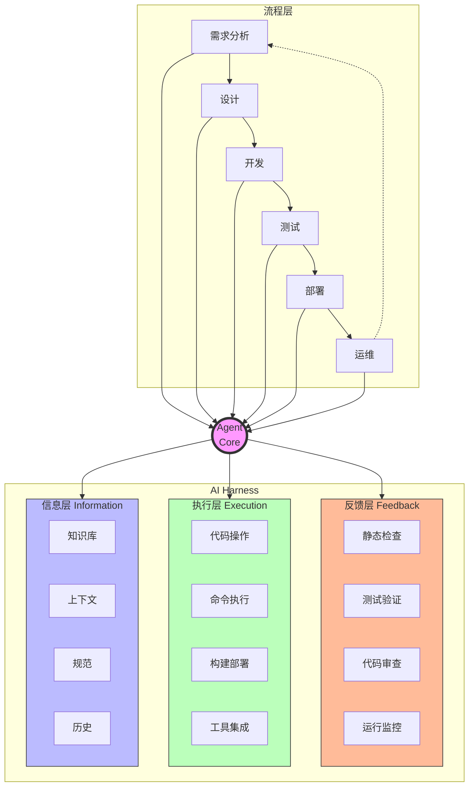
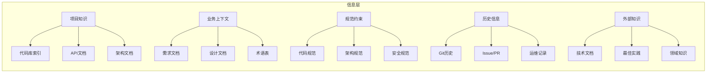
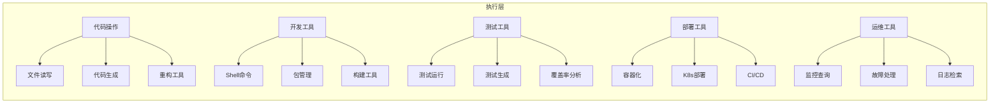
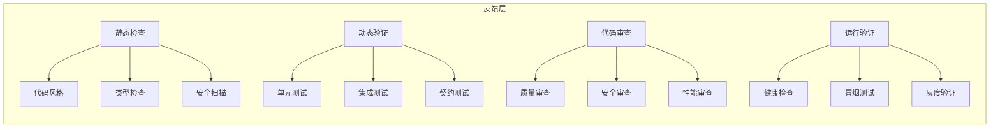
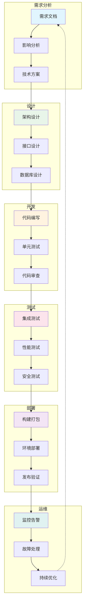
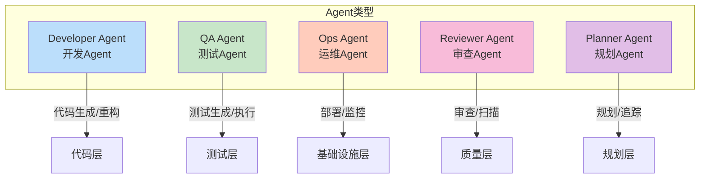
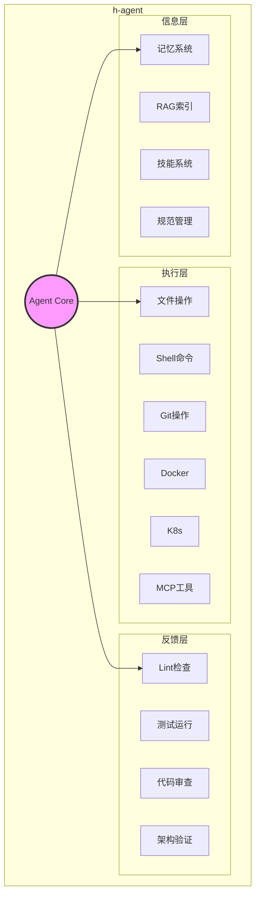
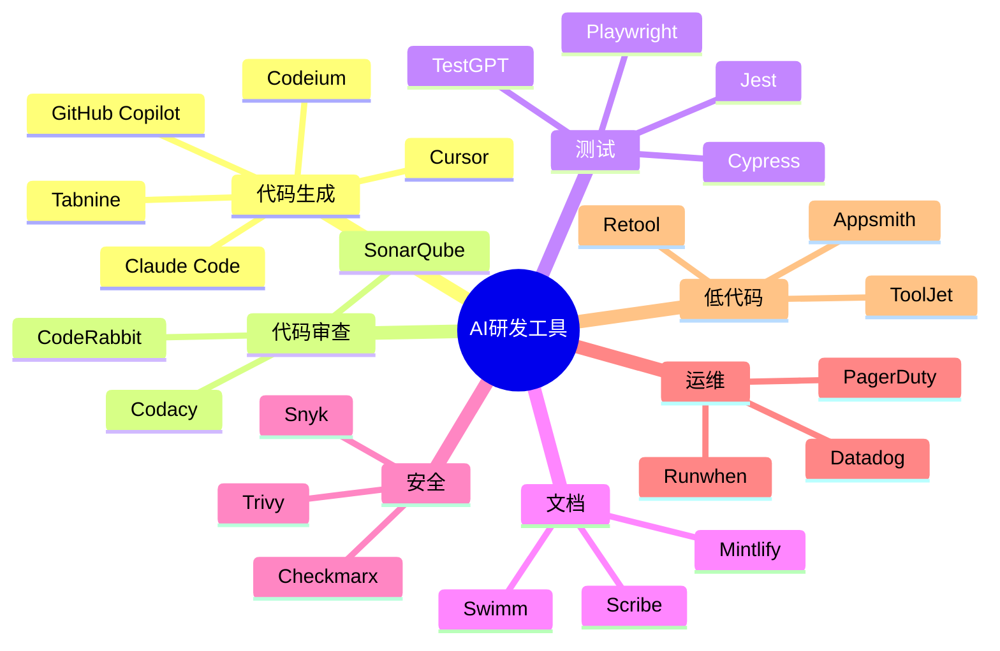
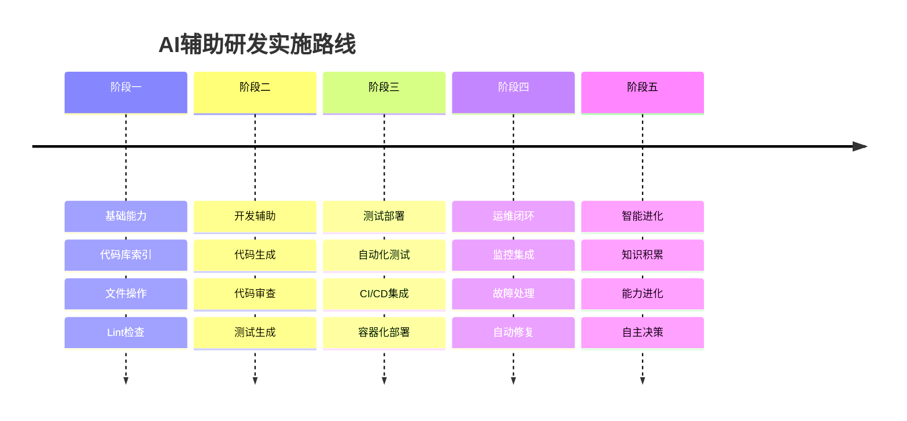

# AI辅助研发工具地图

> 以Agent为核心，Harness为边界，覆盖从设计到部署的完整研发流程

---

## 核心架构图

---

## 一、信息层 (Information Layer)

> 为Agent提供知识、上下文、规范和历史信息

### 架构图

### 工具列表

#### 项目知识

| 类型 | 工具 | 说明 | 链接 |
|------|------|------|------|
| 代码索引 | **Chroma** | 向量数据库，代码语义搜索 | [chromadb.com](https://www.trychroma.com/) |
| | **Pinecone** | 托管向量数据库 | [pinecone.io](https://www.pinecone.io/) |
| | **Weaviate** | 开源向量搜索引擎 | [weaviate.io](https://weaviate.io/) |
| API文档 | **Swagger** | API文档标准 | [swagger.io](https://swagger.io/) |
| | **Postman** | API平台 | [postman.com](https://www.postman.com/) |
| 架构文档 | **Structurizr** | 架构文档即代码 | [structurizr.com](https://structurizr.com/) |
| | **C4 Model** | 架构图标准 | [c4model.com](https://c4model.com/) |

#### 业务上下文

| 类型 | 工具 | 说明 | 链接 |
|------|------|------|------|
| 需求管理 | **Linear** | 现代化需求管理 | [linear.app](https://linear.app/) |
| | **Jira** | 企业需求管理 | [atlassian.com/jira](https://www.atlassian.com/jira) |
| 设计协作 | **Figma** | 设计工具 | [figma.com](https://www.figma.com/) |
| 流程图 | **Mermaid** | 文本转图表 | [mermaid.js.org](https://mermaid.js.org/) |
| | **Draw.io** | 在线绘图 | [draw.io](https://app.diagrams.net/) |

#### 规范约束

| 类型 | 工具 | 说明 | 链接 |
|------|------|------|------|
| 代码规范 | **ESLint** | JS/TS Lint | [eslint.org](https://eslint.org/) |
| | **Prettier** | 代码格式化 | [prettier.io](https://prettier.io/) |
| | **Checkstyle** | Java Lint | [checkstyle.org](https://checkstyle.org/) |
| 架构规范 | **ArchUnit** | Java架构测试 | [archunit.org](https://www.archunit.org/) |
| 安全规范 | **SonarQube** | 代码质量平台 | [sonarqube.org](https://www.sonarqube.org/) |

---

## 二、执行层 (Execution Layer)

> 为Agent提供工具、命令、操作和集成能力

### 架构图

### 工具列表

#### 代码操作

| 类型 | 工具 | 说明 | 链接 |
|------|------|------|------|
| AI编码 | **Cursor** | AI代码编辑器 | [cursor.sh](https://cursor.sh/) |
| | **GitHub Copilot** | AI代码助手 | [github.com/features/copilot](https://github.com/features/copilot) |
| | **Claude Code** | Anthropic代码助手 | [anthropic.com](https://www.anthropic.com/) |
| | **Codeium** | 免费代码助手 | [codeium.com](https://codeium.com/) |
| 代码搜索 | **Sourcegraph** | 代码搜索平台 | [sourcegraph.com](https://sourcegraph.com/) |
| | **Ast-grep** | 代码结构搜索 | [ast-grep.github.io](https://ast-grep.github.io/) |

#### 开发工具

| 类型 | 工具 | 说明 | 链接 |
|------|------|------|------|
| 版本控制 | **Git** | 版本控制 | [git-scm.com](https://git-scm.com/) |
| | **GitHub** | 代码托管 | [github.com](https://github.com/) |
| | **GitLab** | DevOps平台 | [gitlab.com](https://gitlab.com/) |
| 包管理 | **npm** | Node包管理 | [npmjs.com](https://www.npmjs.com/) |
| | **Maven** | Java包管理 | [maven.apache.org](https://maven.apache.org/) |
| 构建 | **Webpack** | JS构建工具 | [webpack.js.org](https://webpack.js.org/) |
| | **Vite** | 下一代构建工具 | [vitejs.dev](https://vitejs.dev/) |

#### 测试工具

| 类型 | 工具 | 说明 | 链接 |
|------|------|------|------|
| 单元测试 | **Jest** | JS测试框架 | [jestjs.io](https://jestjs.io/) |
| | **Pytest** | Python测试框架 | [docs.pytest.org](https://docs.pytest.org/) |
| | **JUnit** | Java测试框架 | [junit.org](https://junit.org/) |
| E2E测试 | **Playwright** | 跨浏览器测试 | [playwright.dev](https://playwright.dev/) |
| | **Cypress** | Web测试框架 | [cypress.io](https://www.cypress.io/) |
| 测试生成 | **TestGPT** | AI测试生成 | [codium.ai](https://www.codium.ai/) |

#### 部署工具

| 类型 | 工具 | 说明 | 链接 |
|------|------|------|------|
| 容器化 | **Docker** | 容器平台 | [docker.com](https://www.docker.com/) |
| 编排 | **Kubernetes** | 容器编排 | [kubernetes.io](https://kubernetes.io/) |
| | **Helm** | K8s包管理 | [helm.sh](https://helm.sh/) |
| CI/CD | **GitHub Actions** | GitHub CI/CD | [github.com/features/actions](https://github.com/features/actions) |
| | **GitLab CI** | GitLab CI/CD | [docs.gitlab.com/ee/ci](https://docs.gitlab.com/ee/ci/) |
| | **Jenkins** | 开源CI/CD | [jenkins.io](https://www.jenkins.io/) |
| IaC | **Terraform** | 基础设施即代码 | [terraform.io](https://www.terraform.io/) |
| | **Pulumi** | 现代IaC | [pulumi.com](https://www.pulumi.com/) |

#### 运维工具

| 类型 | 工具 | 说明 | 链接 |
|------|------|------|------|
| 监控 | **Prometheus** | 指标监控 | [prometheus.io](https://prometheus.io/) |
| | **Grafana** | 可观测平台 | [grafana.com](https://grafana.com/) |
| 日志 | **ELK Stack** | 日志平台 | [elastic.co/elasticsearch](https://www.elastic.co/elasticsearch/) |
| | **Loki** | 日志聚合 | [grafana.com/oss/loki](https://grafana.com/oss/loki/) |
| APM | **Datadog** | 全栈监控 | [datadoghq.com](https://www.datadoghq.com/) |
| | **Jaeger** | 分布式追踪 | [jaegertracing.io](https://www.jaegertracing.io/) |

---

## 三、反馈层 (Feedback Layer)

> 验证、检查、纠正和评估Agent的行为

### 架构图

### 工具列表

#### 静态检查

| 类型 | 工具 | 说明 | 链接 |
|------|------|------|------|
| 代码质量 | **SonarQube** | 代码质量平台 | [sonarqube.org](https://www.sonarqube.org/) |
| | **Codacy** | 代码质量分析 | [codacy.com](https://www.codacy.com/) |
| 类型检查 | **TypeScript** | JS类型系统 | [typescriptlang.org](https://www.typescriptlang.org/) |
| | **mypy** | Python类型检查 | [mypy-lang.org](https://mypy-lang.org/) |
| 安全扫描 | **Snyk** | 安全漏洞扫描 | [snyk.io](https://snyk.io/) |
| | **Checkmarx** | 应用安全测试 | [checkmarx.com](https://checkmarx.com/) |
| | **Trivy** | 容器安全扫描 | [aquasec.github.io/trivy](https://aquasec.github.io/trivy/) |

#### 动态验证

| 类型 | 工具 | 说明 | 链接 |
|------|------|------|------|
| 测试框架 | **Jest** | JS测试 | [jestjs.io](https://jestjs.io/) |
| | **Pytest** | Python测试 | [pytest.org](https://docs.pytest.org/) |
| 覆盖率 | **Istanbul** | JS覆盖率 | [istanbul.js.org](https://istanbul.js.org/) |
| | **Coverage.py** | Python覆盖率 | [coverage.readthedocs.io](https://coverage.readthedocs.io/) |
| 契约测试 | **Pact** | 消费者驱动契约 | [pact.io](https://pact.io/) |

#### 代码审查

| 类型 | 工具 | 说明 | 链接 |
|------|------|------|------|
| AI审查 | **CodeRabbit** | AI代码审查 | [coderabbit.ai](https://coderabbit.ai/) |
| | **CodeReview.ai** | AI审查助手 | [codereview.ai](https://www.codereview.ai/) |
| PR分析 | **PullRequest** | PR自动审查 | [pullrequest.com](https://www.pullrequest.com/) |
| 质量 | **SonarCloud** | 云端代码质量 | [sonarcloud.io](https://sonarcloud.io/) |

#### 运行验证

| 类型 | 工具 | 说明 | 链接 |
|------|------|------|------|
| 健康检查 | **Healthchecks.io** | 健康监控 | [healthchecks.io](https://healthchecks.io/) |
| 冒烟测试 | **Postman** | API测试 | [postman.com](https://www.postman.com/) |
| 灰度发布 | **Flagger** | 渐进式交付 | [flagger.app](https://flagger.app/) |
| 混沌工程 | **Chaos Monkey** | 故障注入 | [netflix.github.io/chaosmonkey](https://netflix.github.io/chaosmonkey/) |

---

## 四、研发流程全景图

### 各阶段工具矩阵

| 阶段 | 信息层 | 执行层 | 反馈层 |
|------|--------|--------|--------|
| **需求分析** | Linear, Jira, Notion | 需求解析, 影响分析 | 需求评审 |
| **设计** | Figma, Draw.io, Mermaid | 架构图生成, API设计 | 设计评审 |
| **开发** | 代码库索引, 规范文档 | Cursor, Copilot, Claude Code | Lint, 测试, 审查 |
| **测试** | 测试用例库, 测试数据 | Jest, Playwright, Cypress | 测试报告, 覆盖率 |
| **部署** | 部署配置, 环境变量 | Docker, K8s, ArgoCD | 健康检查, 冒烟测试 |
| **运维** | 运维手册, 监控配置 | Prometheus, Grafana | 告警分析, 故障复盘 |

---

## 五、Agent类型

### Agent能力矩阵

| Agent类型 | 信息层依赖 | 执行层能力 | 反馈层输出 |
|-----------|------------|------------|------------|
| **Developer** | 代码库, 规范, 模板 | 代码生成, 文件操作, 重构 | Lint结果, 测试结果 |
| **QA** | 测试规范, 用例库 | 测试生成, 测试执行 | 测试报告, 覆盖率报告 |
| **Ops** | 监控配置, 运维手册 | 部署, 扩缩容, 故障处理 | 健康状态, 告警报告 |
| **Reviewer** | 审查规范, 最佳实践 | 代码审查, 安全扫描 | 审查报告, 风险评估 |
| **Planner** | 需求文档, 架构文档 | 任务分解, 进度追踪 | 计划, 进度报告 |

### 代表性工具

| Agent类型 | 工具 | 链接 |
|-----------|------|------|
| Developer | Cursor | [cursor.sh](https://cursor.sh/) |
| | GitHub Copilot | [github.com/features/copilot](https://github.com/features/copilot) |
| | Claude Code | [anthropic.com](https://www.anthropic.com/) |
| QA | TestGPT / CodiumAI | [codium.ai](https://www.codium.ai/) |
| | Katalon | [katalon.com](https://www.katalon.com/) |
| Ops | Datadog AI | [datadoghq.com](https://www.datadoghq.com/) |
| | Runwhen | [runwhen.com](https://www.runwhen.com/) |
| Reviewer | CodeRabbit | [coderabbit.ai](https://coderabbit.ai/) |
| | SonarQube | [sonarqube.org](https://www.sonarqube.org/) |
| Planner | Linear AI | [linear.app](https://linear.app/) |
| | Notion AI | [notion.so](https://www.notion.so/) |

---

## 六、h-agent定位

### h-agent特性

| 特性 | 说明 | 对应Harness层 |
|------|------|---------------|
| 多Agent协作 | PM/Dev/QA/Ops多角色Agent | 信息层 |
| 记忆系统 | 长期记忆+会话记忆 | 信息层 |
| RAG集成 | 代码库语义索引 | 信息层 |
| 技能系统 | 可扩展能力模块 | 执行层 |
| MCP工具 | 外部工具集成 | 执行层 |
| 权限控制 | 细粒度权限管理 | 反馈层 |
| 任务调度 | Cron+Heartbeat | 执行层 |
| 多渠道 | CLI/REPL/IDE/消息 | 执行层 |

### h-agent覆盖范围

| 阶段 | 覆盖程度 | 说明 |
|------|----------|------|
| 需求分析 | ⚪ 部分 | 可解析需求文档，追踪任务 |
| 设计 | ⚪ 部分 | 可生成Mermaid图表 |
| 开发 | 🟢 完整 | 代码生成、文件操作、Git |
| 测试 | 🟢 完整 | 测试运行、覆盖率分析 |
| 部署 | 🟡 基本 | Docker、K8s操作 |
| 运维 | 🟡 基本 | 监控查询、告警处理 |

---

## 七、工具速查表

### 按能力分类

### 精选工具清单

| 领域 | 首选工具 | 备选工具 | 链接 |
|------|----------|----------|------|
| AI编码 | Cursor | Copilot, Claude Code | [cursor.sh](https://cursor.sh/) |
| 代码审查 | CodeRabbit | SonarQube | [coderabbit.ai](https://coderabbit.ai/) |
| 测试生成 | CodiumAI | TestGPT | [codium.ai](https://www.codium.ai/) |
| 监控 | Datadog | Grafana+Prometheus | [datadoghq.com](https://www.datadoghq.com/) |
| CI/CD | GitHub Actions | GitLab CI, Jenkins | [github.com/features/actions](https://github.com/features/actions) |
| 需求管理 | Linear | Jira, Notion | [linear.app](https://linear.app/) |
| 设计协作 | Figma | Draw.io | [figma.com](https://www.figma.com/) |

---

## 八、实施路线

---

*本文档使用Mermaid图表展示AI辅助研发工具地图，所有工具链接均可点击访问。*